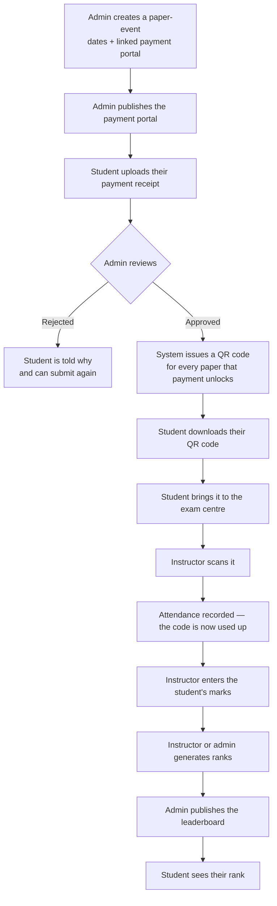

# Papers, Slots and Correlations — how it all works

A guide for anyone who needs to understand this system, written assuming you know nothing about it.

---

## 1. The one-paragraph version

Students pay monthly for classes. When an admin approves a student's payment, the system
automatically issues them a **QR code for each exam paper** that payment entitles them to. The
student brings that QR code to the exam centre, an instructor scans it to record attendance, and
later the instructor enters their marks. Marks feed a leaderboard the student can see once an admin
publishes it.

---

## 2. The pieces, in plain words

| Thing | What it really is |
|---|---|
| **Payment portal** | One month's payment, e.g. "September Main Revision". Students submit a payment receipt against it. |
| **Payment submission** | A student's uploaded receipt for one portal. Starts `PENDING`, an admin makes it `APPROVED` or `REJECTED`. |
| **Paper-event** | One exam paper *as scheduled*: a title, a date window students may sit it in, and the payment portal(s) that unlock it. |
| **Paper slot** | A student's personal ticket to one paper. Holds the QR code. Created automatically when a payment is approved. |
| **Correlation** | A group saying "these two paper-events are the same real paper." Explained in §6. |
| **Mark** | One student's score on one paper, typed in by an instructor. |
| **Leaderboard** | Students ranked by total marks for a paper. Hidden until an admin publishes it. |

The two words that confuse newcomers:

- A **slot** is not a time slot. It's one student's entitlement to sit one paper — effectively their ticket.
- A **paper centre** is a physical location where students sit papers. Nothing to do with a "paper".

---

## 3. The journey, end to end

Nobody creates a QR code by hand. It appears the moment a payment is approved, and it is the
approval that entitles the student, not the QR itself.

---

## 4. What each role actually does

### Main admin

The only role that can create or change papers.

- Creates **paper-events**: title, date window, and which payment portal(s) unlock them.
- Sets the **mark scheme** — which sections exist (MCQ, Structured, Essay) and what each is marked out of.
- Approves or rejects payment receipts. **Approving is what issues the QR codes.**
- Publishes a leaderboard once ranks have been generated.
- Manages **correlations** (§6).

### Instructor

- **Scans QR codes** at the exam centre to record attendance. A code can only be used once.
- **Enters marks**, looked up by the student's code number.
- Can generate ranks for a leaderboard, but cannot publish it.
- Sees every paper's event on their calendar.

Worth knowing: **marks are independent of attendance.** An instructor can record marks for a
student who never had a QR code scanned. Deliberate — a student shouldn't lose their marks over a
scanning mishap.

### Student

- Uploads a payment receipt for a month's portal, confirming the portal name by typing it.
- Once approved, **downloads their QR code** and brings it to the exam centre.
- Sees the papers they're entitled to on their calendar.
- Sees their own marks and, once published, their leaderboard rank.

---

## 5. The QR code's life

A slot is always in exactly one state, worked out live from today's date:

| State | Meaning |
|---|---|
| `SCHEDULED` | The paper's window hasn't opened yet. Scanning is refused. |
| `AVAILABLE` | Within the window. Scanning works. |
| `EXPIRED` | The window has closed. Scanning is refused. |
| `CONSUMED` | It has been scanned. Permanent — it can never be un-scanned. |

Consuming is a single conditional database update, so two instructors scanning the same code at the
same instant can't both succeed. Exactly one wins.

---

## 6. Correlations — the part that needs explaining

### The problem

Students need a few days into a new month to pay. So a paper sat in the **first week of November**
has to be available to two different groups:

- students who paid in **October** and are getting early access
- students paying in **November**, who can't be shut out just because they paid on the 3rd

The way this is scheduled is to create the **same paper twice**, with different windows and
different portals:

| | Window | Unlocked by |
|---|---|---|
| **Sitting A** | Nov 2 – Nov 4 | October's payment portal |
| **Sitting B** | Nov 2 – Nov 6 | November's payment portal |

These are two rows in the database, but **one real exam paper**.

Before correlations existed, a student who paid **both** months matched both, and so received
**two QR codes for one paper** — scannable twice, counted twice in attendance, and with their marks
and leaderboard split across the two rows.

### The fix

A **correlation** (e.g. code `NOV-W1`, display name "November Week 1 Paper") groups the sittings
and owns everything that belongs to the paper rather than to a sitting of it:

| Belongs to the **correlation** | Belongs to each **paper-event** |
|---|---|
| The mark scheme | Its own date window |
| All the marks | Which portal unlocks it |
| The leaderboard | Its calendar event |
| | Its slots |

So for the student who paid both months:

1. October's approval issues **one** QR code, valid to Nov 4.
2. November's approval does **not** issue a second one. It **widens the existing code** to Nov 6.
3. The same code appears under **both** months on their payments page, so neither looks empty.

The window only ever moves later, so it makes no difference which payment is approved first, and
re-approving changes nothing. **A code that has already been scanned stays scanned** — a second
payment doesn't entitle anyone to sit the paper twice.

### What everyone sees

- **Main admin** sees both sittings separately, each tagged with its correlation code — they're the
  one scheduling them, so they need to tell them apart.
- **Instructors and students** see **one paper**, named by the correlation's display name. A student
  who only paid October must never be shown "Nov 2 – 6" when their own access ends on the 4th.

A main admin can check this for themselves under **Papers → Instructor View**, which opens the
instructor's own screens read-only — the same pages instructors use, with every action withheld, so
looking can't change real marks. It additionally tags each entry with its correlation code, since an
admin needs to know which grouping produced what they're looking at.

### Creating a pair

Create the first sitting, then use **Duplicate** on it. The copy arrives pre-filled — the second
sitting differs only in its end date and which portal it's linked to, and Duplicate carries across
the mark scheme and the correlation, the two things that have to match.

---

## 7. Rules that trip people up

| Rule | Why it exists |
|---|---|
| A paper-event can only join or move correlation **before it starts** | The grouping decides who gets a code for what; changing it mid-sitting changes that under students' feet. (Leaving a correlation outright isn't supported at all — see §10.) |
| …and only while it has **no marks of its own** | Marks would be stranded, since grading moves to the correlation. |
| Joining is **refused** if a student already holds a code in that correlation | They'd end up with two for one paper. The error names those students so you can cancel the surplus — nothing is deleted automatically, since a student may already be carrying that code. |
| The **mark scheme locks** once any mark exists | Changing what a paper is marked out of after marking has begun invalidates the marks already entered. |
| Both sittings must use the **same mark scheme** | It lives on the correlation, so they physically cannot differ. Joining with a conflicting one is refused rather than silently overwriting. |
| A leaderboard can't be **published** before ranks are generated | There'd be nothing to show. |
| Correlation codes are **uppercased, no spaces** (`NOV-W1`) | So the same code typed two ways can't silently become two groups. |
| A correlation can only be **deleted** when nothing uses it | It holds the marks and leaderboard for every sitting in it. |

Renaming a correlation is always safe, at any time — paper-events are grouped by internal id, never
by the code text. Renaming is the way to fix a typo students can see.

---

## 8. Practical guidance for staff

**Create every paper-event before publishing the payment portal**, including next month's
early-access ones. Then group them, and no restriction can ever get in your way.

If you forget and only group them later, that still works — existing codes are brought into the
group automatically. The one case that fails is when a student has *already* been issued two codes
for the paper; you'll be told exactly who, and you cancel one.

---

## 9. For developers

Service: `dl-payment-submission-portal-service` (Spring Boot, Postgres, Liquibase).

| Concept | Where |
|---|---|
| Paper-event | `entity/Paper.java` |
| Correlation | `entity/PaperCorrelation.java` |
| What owns grading | `entity/MarkOwner.java`, `service/MarkOwnerResolver.java` |
| Slot + its window | `entity/PaperSlot.java` (`effectiveEndDate()`) |
| Slot issuing / extending | `service/PaperSlotService.java`, `service/PaperSlotWriter.java` |
| Marks, leaderboard | `service/PaperMarkService.java` |
| Audit trail | `entity/PaperAuditLog.java`, `service/PaperAuditService.java` |
| Schema | `db/changelog/016-paper-correlations.yaml`, `017-paper-audit-log.yaml` |

Two things worth knowing before changing anything here:

1. **A slot's end date is `validUntil` if set, otherwise its paper's `endDate`.** That rule appears
   in four places — the mapper, the consume fallback, the consume SQL and the list filter. Miss one
   and extended codes behave inconsistently depending on which screen you look at.
2. **A slot records its correlation when it is created.** That stamp is what prevents a duplicate,
   which is why grouping a paper-event re-stamps its existing slots.

Tests run against **H2** while production is **Postgres**, so migrations must use portable SQL.
`PaperCorrelationSlotServiceTest` covers the slot behaviour; `PaperCorrelationControllerTest` covers
the admin-facing rules.

---

## 10. Not built yet

Accurate as of this document:

- The **student leaderboard list** isn't collapsed per correlation yet. A student in a correlated
  paper sees the correlation's display name on each entry, but a pair still shows as two rows there.
- The **audit trail** is written but has no screen — read `paper_audit_log` with SQL for now.
- **Untagging** a paper-event — removing it from a correlation without putting it in another one —
  isn't possible at all, by any route but SQL. A paper-event can be **moved** to a different
  correlation, but sending no correlation reads as "leave this field alone" rather than "remove it",
  so there is nothing to untag with. Worth knowing before you tag: a mistake is corrected by
  re-tagging, not by undoing.

---

## Glossary

**Paper-event** — one scheduled sitting of a paper: dates plus the portal that unlocks it.
**Slot** — a student's personal entitlement to one paper; carries the QR code.
**Correlation** — a group saying several paper-events are the same real paper.
**Portal** — one month's payment that students submit a receipt against.
**Consume** — scanning a QR code, which records attendance and uses the code up permanently.
**Mark scheme** — which sections a paper has and what each is marked out of.
**Paper centre** — a physical location where students sit papers.
